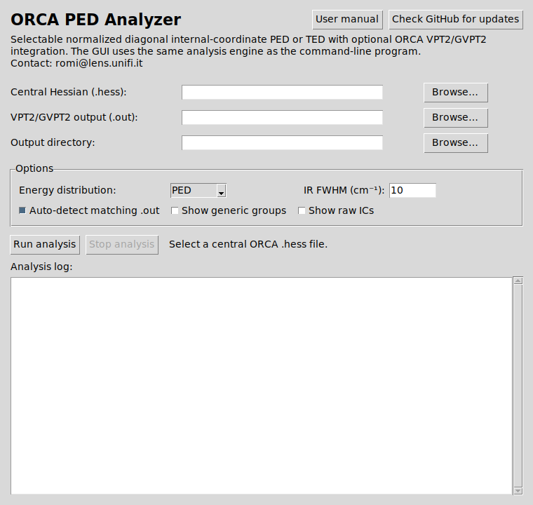

**Author:** Sebastiano Romi  
**Affiliation:** European Laboratory for non-Linear Spectroscopy (LENS), Università degli Studi di Firenze (UNIFI)  
**Contact:** [romi@lens.unifi.it](mailto:romi@lens.unifi.it)

# Purpose

**ORCA PED Analyzer** performs a molecule-agnostic analysis of ORCA normal modes using a normalized diagonal potential-energy distribution (PED) in internal coordinates. It adds hierarchical/topological assignments, optional VPT2/GVPT2 post-processing, broadened IR spectra, CSV exports, and an Avogadro CJSON file containing all harmonic normal modes.

The program is designed around a conservative principle: **assignments are derived from the calculated atomic motion and the internal-coordinate energy decomposition, not from empirical frequency windows.**

## Main input

```text
molecule.hess      # always the CENTRAL ORCA Hessian
molecule.out       # optional VPT2/GVPT2 output; auto-detected for same basename
```

Never use displaced VPT2 Hessians such as:

```text
molecule_D001.hess
molecule_D002.hess
...
```

as input to the analyzer.

## Main output

By default, the script creates:

```text
molecule_analysis/
  molecule_summary.csv
  molecule_families.csv
  molecule_ped.csv
  molecule_IR_fundamentals.dat
  molecule_IR_anharmonic.dat       # if valid VPT2 is available
  molecule_IR_complete.dat         # if valid VPT2 is available
  molecule_avogadro_vibrations.cjson
  molecule_vpt2_bands.csv          # if valid VPT2 is available
  molecule_fermi.txt               # if a Fermi block is present
  molecule_manifest.txt
```

The PED and Avogadro vectors describe **harmonic normal modes**. When a valid VPT2 calculation is available, VPT2 fundamental frequencies are used in the relevant tables and spectra, while overtone and combination bands are read directly from the ORCA VPT2 output.

# 1. Main features of version 2.9.9

- **Desktop applications.** Pre-built Linux AppImage, Windows executable and macOS DMG packages provide a graphical interface without requiring a local Python installation.
- **Interactive desktop workflow.** The GUI provides automatic VPT2 detection, configurable IR FWHM, generic/raw assignment controls, a live analysis log and the ability to stop a running analysis.
- **Interactive IR viewer.** After a successful analysis, generated IR spectra are displayed automatically when available; individual spectra can be shown/hidden and the embedded Matplotlib toolbar provides zoom, pan, navigation and save controls.
- **Single output directory.** All generated files are written to `BASENAME_analysis/` by default.
- **Three IR spectra.** Fundamentals; anharmonic-only overtone/combination bands; complete spectrum.
- **Automatic VPT2 preference.** If VPT2 is complete and numerically valid, fundamental spectra and tables use the VPT2 fundamental frequencies; otherwise harmonic frequencies are retained.
- **Numerical VPT2 validation.** A normally terminated ORCA job containing `inf` or `nan` in the VPT2 fundamentals is classified as complete but invalid, and its anharmonic data are ignored.
- **Avogadro CJSON.** One native CJSON file stores geometry, harmonic intensities, harmonic frequencies and all harmonic normal-mode vectors.
- **Consistent Avogadro numbering.** Translational/rotational entries preceding the true vibrations are retained in the CJSON so that Avogadro mode numbers match the ORCA/PED mode numbers. For a nonlinear molecule, the first true vibration is normally displayed as mode 6.
- **Manifest.** Each run records the script version, inputs, VPT2 state, IR broadening parameters and generated files.
- **Molecule-agnostic PED.** Topological assignments, generic families and primitive internal coordinates with phase remain available.

# 2. Ways to run ORCA PED Analyzer

ORCA PED Analyzer can be used either as a **pre-built desktop application** or directly from the Python source code. For most users, the desktop application is the simplest option because it does not require a Python environment or terminal commands.

## 2.1 Pre-built desktop applications - recommended for most users

Ready-to-run applications are provided on the GitHub Releases page:

<https://github.com/SebRoLENS/orca-ped-analyzer/releases/latest>

The current release provides:

- **Linux x86_64:** `ORCA-PED-Analyzer-Linux-x86_64.AppImage` - portable AppImage.
- **Windows x86_64:** `ORCA-PED-Analyzer.exe` - standalone executable.
- **macOS Apple Silicon:** `ORCA-PED-Analyzer-macOS-arm64.dmg` - for Apple M-series Macs.
- **macOS Intel x86_64:** `ORCA-PED-Analyzer-macOS-x86_64.dmg` - for Intel-based Macs.

The packaged applications already contain Python and the required Python dependencies. Therefore, when using these builds, **Python, NumPy and a terminal are not required**.

### Linux

1. Download `ORCA-PED-Analyzer-Linux-x86_64.AppImage` from the latest GitHub release.
2. Mark the file as executable. This can usually be done from the file manager under **Properties -> Permissions**, or from a terminal with:

```bash
chmod +x ORCA-PED-Analyzer-Linux-x86_64.AppImage
```

3. Double-click the AppImage to launch ORCA PED Analyzer.

The AppImage is portable and does not require a traditional installation. It can be kept in any convenient directory.

### Windows

1. Download `ORCA-PED-Analyzer.exe` from the latest GitHub release.
2. Save it in a convenient directory.
3. Double-click the executable to launch the program.

No Python installation or separate installer is required.

### macOS - Apple Silicon or Intel

1. Select the DMG matching the Mac architecture:
   - `ORCA-PED-Analyzer-macOS-arm64.dmg` for Apple Silicon (M-series);
   - `ORCA-PED-Analyzer-macOS-x86_64.dmg` for Intel Macs.
2. Open the downloaded DMG.
3. Copy **ORCA PED Analyzer.app** to the `Applications` folder or another preferred location.
4. Launch the application normally from Finder.

No Python installation is required.

## 2.2 Using the graphical application

The graphical launcher runs the same scientific analysis engine as the command-line program and exposes the options most commonly needed for interactive work.



### Main controls

1. **Central Hessian (`.hess`).** Select the central ORCA Hessian. Displaced VPT2 Hessians such as `molecule_D001.hess` must not be used as the main input.
2. **VPT2/GVPT2 output (`.out`).** This is optional. A completed output can be selected explicitly, or **Auto-detect matching `.out`** can be left enabled so that the analyzer searches for the corresponding output automatically.
3. **Output directory.** Leave this empty to use the default `BASENAME_analysis/` directory, or select another location.
4. **Show generic groups.** Enables the same generic element/type assignment families provided by the command-line `--show-generic` option.
5. **Show raw ICs.** Includes primitive internal-coordinate contributions and phase information, corresponding to `--show-raw`.
6. **IR FWHM.** Sets the Gaussian broadening width used for generated IR spectra. The default is 10 cm^-1.
7. **Run analysis.** Starts the calculation in a separate process so that the graphical interface remains responsive.
8. **Stop analysis.** Terminates a running analysis. Partial output files may remain if the run is stopped before completion.

### Live analysis log

The lower part of the main window contains a live log showing the output of the analysis process. Warnings and errors are also forwarded to this panel, making it possible to follow progress and diagnose problems without opening a terminal.

### Automatic IR spectrum viewer

After a successful analysis, the GUI searches the selected output directory for generated `*_IR_*.dat` files. If one or more spectra are present, an **IR spectra** window opens automatically.

The viewer can display the fundamentals, anharmonic-only and complete spectra generated by the run. Each available curve has a checkbox and can be shown or hidden independently. The embedded Matplotlib navigation toolbar provides the usual zoom, pan, back/forward navigation and figure-saving controls.

The plotted data are exactly the same `.dat` files written by the analysis engine; the viewer is therefore a visualization layer and does not modify the scientific results.

### Manual, updates and contact

The top of the GUI contains direct links to the user manual and the GitHub repository/release page. The author contact address is also shown in the graphical interface. If the operating system cannot open a link automatically, the application displays the explicit URL so that it can be copied into a browser.

The generated PED tables, assignments, spectra, VPT2 information and Avogadro CJSON files are the same scientific outputs produced by the corresponding command-line analysis.

## 2.3 Security warnings and unsigned builds

The current desktop applications are **not digitally code-signed or notarized**. Consequently, operating-system security mechanisms may display a warning when the application is launched for the first time.

- **Windows:** Microsoft SmartScreen may report that the publisher is unknown or ask for confirmation before running the application.
- **macOS:** Gatekeeper may report that the developer cannot be verified and may require the user to explicitly allow or open the application.
- **Linux:** AppImage files are not normally affected by an equivalent publisher-signing warning, but the executable permission may need to be enabled before first use.

These warnings are expected for unsigned software downloaded from the Internet and indicate that the operating system cannot verify a code-signing identity for the publisher. They are separate from the scientific operation of the program.

For additional verification, each GitHub release includes `SHA256SUMS.txt`, containing SHA-256 checksums for the distributed application files. Users who require strict software provenance can compare the checksum of the downloaded file with the value published in the release.

The application source code and the GitHub Actions build workflow used to create the distributed packages are public in this repository.

## 2.4 Running from source / command line

The Python source version remains the preferred interface for advanced command-line options, scripting and reproducible automated workflows.

Requirements for the **source version only**:

- Python 3.9 or newer
- NumPy
- Matplotlib

Install the dependencies with:

```bash
python3 -m pip install -r requirements.txt
```

On Debian, NumPy can alternatively be installed with:

```bash
sudo apt install python3-numpy
```

Check the script version and available options with:

```bash
python3 orca_ped_analyzer.py --version
python3 orca_ped_analyzer.py --help
```

Expected public version:

```text
orca_ped_analyzer.py 2.9.9
```

# 3. Which Hessian should be used?

## 3.1 Central Hessian

The PED always uses the central ORCA Hessian:

```text
molecule.hess
```

The script reads or derives from this file:

- molecular geometry,
- Cartesian Hessian,
- harmonic frequencies,
- harmonic normal-mode eigenvectors,
- harmonic IR information.

The central Hessian is also the source of the vectors exported to Avogadro.

## 3.2 Displaced VPT2 Hessians

Files such as:

```text
molecule_D001.hess
molecule_D002.hess
...
```

are intermediate ORCA files used to construct the anharmonic force field. They are **not** input files for the PED analyzer.

**Practical rule:** use one central `.hess` for the PED. Add VPT2 information by supplying the associated ORCA `.out`; do not switch to a displaced Hessian.

# 4. Command-line quick start

## 4.1 Minimum command

```bash
python3 orca_ped_analyzer.py molecule.hess
```

If `molecule.out` exists beside the Hessian, it is automatically inspected. A complete and numerically valid VPT2 analysis is incorporated.

## 4.2 VPT2 output with another name

Useful after a restarted calculation:

```bash
python3 orca_ped_analyzer.py molecule.hess \
    --vpt2-out molecule_restart.out
```

## 4.3 Disable automatic VPT2 detection

```bash
python3 orca_ped_analyzer.py molecule.hess --no-auto-vpt2
```

## 4.4 Recommended detailed run

```bash
python3 orca_ped_analyzer.py molecule.hess \
    --show-generic --show-raw \
    --family-top 6 --family-min-percent 2 \
    --top 10 --min-percent 1 \
    --ir-fwhm 5
```

# 5. Output directory and manifest

By default the output directory is:

```text
BASENAME_analysis/
```

For `propanamine_VPT2.hess`, for example:

```text
propanamine_VPT2_analysis/
  propanamine_VPT2_summary.csv
  propanamine_VPT2_families.csv
  propanamine_VPT2_ped.csv
  propanamine_VPT2_IR_fundamentals.dat
  propanamine_VPT2_IR_anharmonic.dat
  propanamine_VPT2_IR_complete.dat
  propanamine_VPT2_avogadro_vibrations.cjson
  propanamine_VPT2_vpt2_bands.csv
  propanamine_VPT2_fermi.txt
  propanamine_VPT2_manifest.txt
```

Conditional files appear only when the required information is available and valid.

Choose another output directory with:

```bash
python3 orca_ped_analyzer.py molecule.hess \
    --output-dir vibrational_analysis
```

A relative path is interpreted relative to the Hessian directory.

The manifest records the script version, central Hessian, selected VPT2 output, VPT2 status, IR FWHM and generated files. It is useful for reproducibility.

# 6. VPT2 detection and validation

The program distinguishes **program termination** from **numerical validity**. A VPT2 job can terminate normally but still contain non-finite anharmonic corrections.

| State | Typical message | Analyzer behavior |
|---|---|---|
| Not available | no matching `.out` / no VPT2 section | PED + harmonic fundamentals |
| Incomplete/running | `INCOMPLETE/RUNNING` | partial VPT2 data ignored |
| Complete but invalid | `COMPLETE BUT NUMERICALLY INVALID` | `inf`/`nan` ignored; harmonic data retained |
| Complete and valid | `COMPLETE + VALID` | VPT2 fundamentals, overtone/combination bands and Fermi information integrated |

## 6.1 Complete but numerically invalid

Example diagnostic:

```text
# VPT2: COMPLETE BUT NUMERICALLY INVALID in molecule.out
# fundamental rows=30/30; non-finite fundamentals=30; ...
```

The harmonic PED and CJSON remain usable. The fundamentals spectrum is produced using harmonic frequencies, while the anharmonic-only and complete spectra are not generated.

## 6.2 Mapping VPT2 fundamentals to Hessian modes

ORCA's VPT2 table numbers only vibrational modes, while the Hessian mode list normally also contains translational and rotational entries. The analyzer therefore maps VPT2 fundamentals to the central Hessian by comparing harmonic frequencies.

Default tolerance:

```text
--vpt2-match-tol 10
```

that is, 10 cm^-1. If mapping fails, first verify that the `.hess` and `.out` belong to the same calculation.

# 7. How the PED is calculated

The analyzer creates primitive internal coordinates, numerically constructs the Wilson `B` matrix and selects an independent set spanning the vibrational space: `3N-6` coordinates for a nonlinear molecule or `3N-5` for a linear molecule.

For harmonic normal-mode vector \(l\), the internal-coordinate displacement is

$$
D = B l
$$

The selected internal-coordinate force-constant representation is

$$
F = (B^+)^T H B^+
$$

where \(B^+\) is the pseudoinverse of `B` and `H` is the Cartesian Hessian.

The implemented PED is a normalized diagonal decomposition:

$$
PED_i = 100\,\frac{F_{ii}D_i^2}{\sum_j F_{jj}D_j^2}.
$$

**Important:** the PED describes the mechanical/energetic character of a harmonic normal mode. It is not an IR-intensity percentage and it depends on the chosen internal-coordinate representation.

# 8. Three assignment levels

## 8.1 Topological assignment - default

Primitive internal coordinates are grouped into conservative families that can be inferred from connectivity and graph topology, for example:

- `cyclic C-C stretching`,
- `inter-ring C-C torsion`,
- `ring-site C-H in-plane bending`,
- `exocyclic C-N stretching`.

The analyzer does not invent aromaticity or bond orders such as C=C or C=N from the Hessian alone.

## 8.2 Generic assignment - `--show-generic`

```bash
--show-generic
```

Displays chemistry-independent element/type families such as:

- `C-C stretching`,
- `C-H bending`,
- `C-N stretching`.

## 8.3 Primitive internal coordinates - `--show-raw`

```bash
--show-raw
```

Displays individual coordinates with percentage and relative phase, for example:

```text
nu(C5-C6) 20.84%[+]
```

# 9. Pure, mixed and phase-qualified modes

The assignment does not simply choose the largest individual primitive coordinate. Primitive contributions are first grouped by family; then the program evaluates whether one family dominates or whether the mode should be described as mixed.

Main defaults:

| Parameter | Default | Meaning |
|---|---:|---|
| `--pure-threshold` | 70% | threshold for a non-mixed assignment |
| `--mixed-second` | 20% | sufficiently large second family triggers a mixed assignment |
| `--family-top` | 4 | maximum number of grouped families printed |
| `--family-min-percent` | 2% | grouped families below this threshold are not printed |

For equivalent or closely related stretches, the relative sign of the internal-coordinate displacement can qualify a motion as `in-phase`, `opposite-phase`, or `mixed-phase` when the criterion is sufficiently robust.

# 10. Avogadro CJSON

Unless disabled with `--no-avogadro-cjson`, each run writes:

```text
BASENAME_avogadro_vibrations.cjson
```

It contains:

- geometry,
- inferred connectivity,
- harmonic frequencies,
- harmonic IR intensities,
- all harmonic Cartesian normal-mode vectors.

Open it with Avogadro 2:

```bash
avogadro2 "/full/path/BASENAME_analysis/BASENAME_avogadro_vibrations.cjson"
```

## 10.1 Why are the CJSON frequencies harmonic?

VPT2 corrects state energies and transition frequencies but does not provide the analyzer with a replacement Cartesian normal-mode eigenvector set. The animated vectors therefore remain the harmonic normal modes.

## 10.2 Why does Avogadro start the first real vibration at mode 6?

Avogadro numbers vibration entries sequentially. Version 2.9.9 keeps the preceding translational/rotational entries in the CJSON so that the number displayed by Avogadro matches the ORCA/PED Hessian mode number. For a typical nonlinear molecule:

```text
Avogadro mode 1-5  -> translational/rotational near-zero entries
Avogadro mode 6    -> first true vibration, ORCA/PED mode 6
Avogadro mode 7    -> ORCA/PED mode 7
...
```

This avoids the previous numbering offset.

# 11. Automatically generated IR spectra

The analyzer writes up to three `.dat` files. They are positive-going Gaussian-broadened curves represented as **relative absorbance**, with increasing wavenumber in the output grid.

| File | When | Contents |
|---|---|---|
| `*_IR_fundamentals.dat` | whenever central Hessian IR data are available | fundamentals only; VPT2 frequencies if valid, otherwise harmonic |
| `*_IR_anharmonic.dat` | valid completed VPT2 only | VPT2 overtone + combination bands only |
| `*_IR_complete.dat` | valid completed VPT2 only | VPT2 fundamentals + overtone/combination bands |

## 11.1 Frequency-source rule

```text
complete + valid VPT2 -> VPT2 fundamental frequencies
missing/incomplete/invalid VPT2 -> harmonic Hessian frequencies
```

Fundamental intensities are taken from the IR information in the central harmonic Hessian. Overtone/combination frequencies and intensities come from the ORCA VPT2 output.

## 11.2 Relative absorbance

Each spectrum contains two columns:

```text
wavenumber_cm-1    absorbance_relative
```

The absorbance is relative, not absolute Beer-Lambert absorbance. Concentration and optical path length are not known. Spectra generated in the same run share the same normalization convention, allowing relative visual comparison.

## 11.3 Bandwidth

```bash
python3 orca_ped_analyzer.py molecule.hess --ir-fwhm 5
```

`--ir-fwhm` is the Gaussian full width at half maximum in cm^-1. Default: 10 cm^-1.

## 11.4 Grid range and spacing

```text
--ir-xmin 400 --ir-xmax 4000 --ir-step 0.5
```

If limits are omitted, the range is selected automatically from the available bands and FWHM.

# 12. Example FTIR workflow

For a 400-4000 cm^-1 range, 5 cm^-1 FWHM and 0.5 cm^-1 grid spacing:

```bash
python3 orca_ped_analyzer.py molecule.hess \
    --ir-fwhm 5 \
    --ir-xmin 400 --ir-xmax 4000 --ir-step 0.5
```

With a complete and valid VPT2 output, all three spectra are produced. Otherwise only the fundamentals spectrum is written, using harmonic frequencies.

# 13. Overtones, combination bands and Fermi resonance

For valid VPT2 data, the analyzer reads ORCA overtone and combination-band frequencies and intensities. The textual assignment is derived from the **zero-order harmonic constituents**.

Conceptually:

```text
State       Freq/cm-1    Int/km mol-1    Assignment
2nu0        ...          ...             overtone of ...
nu0+nu1     ...          ...             ... + ...
```

If ORCA prints a Fermi-resonance analysis block, the script records its presence. With:

```bash
--show-fermi
```

it is also printed to the terminal and stored in `*_fermi.txt` when file output is enabled.

**Interpretation:** PED and Avogadro animations describe harmonic zero-order modes. A strongly resonant observed state may be a mixture of zero-order states and should not be treated as a pure fundamental solely from its PED label.

# 14. CSV tables

CSV output is enabled by default.

| File | When | Content |
|---|---|---|
| `*_summary.csv` | always | one row per mode: harmonic frequency, optional VPT2 fundamental, assignment, grouped PED |
| `*_families.csv` | always | topological/generic families and percentages |
| `*_ped.csv` | always | primitive IC, percentage, phase, `D_value`, `F_diagonal` |
| `*_vpt2_bands.csv` | valid VPT2 | overtone/combination data, intensity and assignment |
| `*_fermi.txt` | Fermi block present | original ORCA Fermi-analysis block |

Change the CSV prefix with:

```text
--csv-prefix vib
```

Disable CSV output with:

```text
--no-csv
```

# 15. Selected internal-coordinate set

The terminal output prints the independent internal-coordinate set actually used for the PED, for example:

```text
# Selected internal-coordinate set:
#   1 nu(C1-C2)
#   2 delta(C1-C2-C3)
#   3 tau(C1-C2-C3-C4)
...
```

Inspect this especially for complex molecules, metal-containing systems, unusually long bonds, clusters, or unconventional topology.

# 16. Command-line reference

| Option | Default | Function |
|---|---|---|
| `--vpt2-out FILE` | - | explicitly select VPT2 output |
| `--no-auto-vpt2` | off | do not search for same-basename `.out` |
| `--vpt2-match-tol` | 10 cm^-1 | VPT2 -> Hessian mapping tolerance |
| `--bond-scale` | 1.25 | distance factor for bond detection |
| `--linear-cut` | 175 deg | angles at/above threshold treated as linear bends |
| `--min-freq` | 20 cm^-1 | ignore modes with absolute frequency below threshold |
| `--top` | 5 | number of primitive coordinates shown with `--show-raw` |
| `--min-percent` | 1% | primitive-coordinate reporting threshold |
| `--family-top` | 4 | maximum grouped families displayed |
| `--family-min-percent` | 2% | grouped-family reporting threshold |
| `--pure-threshold` | 70% | non-mixed assignment threshold |
| `--mixed-second` | 20% | second-family threshold for mixed assignment |
| `--show-generic` | off | show generic molecule-agnostic families |
| `--show-raw` | off | show primitive internal coordinates and phase |
| `--show-fermi` | off | print ORCA Fermi block |
| `--output-dir DIR` | `BASENAME_analysis` | directory for generated files |
| `--csv-prefix PREFIX` | Hessian basename | CSV prefix |
| `--no-csv` | off | disable CSV files |
| `--no-avogadro-cjson` | off | disable Avogadro CJSON |
| `--cjson-name FILE` | `*_avogadro_vibrations.cjson` | custom CJSON name |
| `--no-ir-spectra` | off | disable IR spectra |
| `--ir-prefix PREFIX` | Hessian basename | IR file prefix |
| `--ir-fwhm` | 10 cm^-1 | Gaussian FWHM |
| `--ir-xmin / --ir-xmax` | automatic | spectrum range |
| `--ir-step` | 1 cm^-1 | IR grid spacing |

# 17. Quality control and troubleshooting

## 17.1 Cartesian-Hessian reconstruction error

The program reports, for example:

```text
# Cartesian-Hessian reconstruction relative error: 4.462e-06
```

A very small value indicates that the selected internal-coordinate representation reproduces the original Cartesian Hessian well. The script warns above approximately `1e-3`.

| Order of magnitude | Practical interpretation |
|---|---|
| `1e-6` to `1e-4` | very good |
| around `1e-3` | inspect carefully |
| greater than `1e-3` | possible connectivity/internal-coordinate problem |

## 17.2 Degenerate and collective modes

Within an exactly or nearly degenerate subspace, individual eigenvectors can rotate without changing the physical subspace. Primitive-coordinate percentages can therefore be basis-dependent. Grouped assignments and the degenerate set as a whole are usually more robust.

## 17.3 VPT2 containing `inf`/`nan`

This is not treated as a parsing error. It means the anharmonic result is numerically unusable. The analyzer classifies it as `COMPLETE BUT NUMERICALLY INVALID` and discards VPT2 frequencies/bands.

## 17.4 A `_Dxxx.hess` was supplied accidentally

The analyzer reports that the file looks like a displaced VPT2 Hessian and asks for the central Hessian instead.

## 17.5 Multiple fragments or unusual connectivity

Bond recognition uses distances and covalent radii. For clusters, noncovalent contacts, metal systems or multiple fragments, inspect `--bond-scale` and the selected internal-coordinate set carefully.

# 18. Recommended workflow

1. Optimize the geometry to a well-converged minimum.
2. Compute and inspect the central Hessian; check for imaginary frequencies.
3. Run `orca_ped_analyzer.py` on the central Hessian.
4. Inspect the reconstruction error and selected internal-coordinate set.
5. For complex systems, use `--show-generic --show-raw`.
6. If VPT2 is still running, use the harmonic outputs safely; partial anharmonic data are ignored.
7. When VPT2 finishes, rerun the analyzer. If the result is valid, VPT2 fundamental frequencies automatically take priority in the relevant tables and spectra.
8. Open the CJSON in Avogadro to inspect all harmonic normal modes using the same mode numbering as the PED output.
9. Use the three IR spectra to separate fundamentals, anharmonic-only additional bands and the complete simulated spectrum.
10. Archive the entire `*_analysis` directory with the calculation data.

# 19. Reporting results in a scientific publication

For a main-text assignment table, a useful minimal structure is:

| Experimental / cm^-1 | VPT2 / cm^-1 | Assignment |
|---:|---:|---|
| ... | ... | `cyclic C-C stretching` |
| ... | ... | `mixed C-N stretching / cyclic C-C stretching` |

For Supporting Information, retain more detail:

| Mode | Harmonic / cm^-1 | VPT2 / cm^-1 | Anharmonic shift | Calculated IR intensity | Assignment | Grouped PED |
|---:|---:|---:|---:|---:|---|---|
| ... | ... | ... | ... | ... | ... | ... |

Recommended reporting principles:

- use VPT2 fundamentals when the VPT2 result is valid;
- keep harmonic frequencies in the Supporting Information because the PED belongs to the harmonic zero-order modes;
- report multiple grouped PED contributions when no family dominates clearly;
- avoid reporting every primitive coordinate in the main paper;
- provide the complete primitive PED as machine-readable Supporting Data when useful;
- keep overtone/combination assignments separate from fundamentals;
- explicitly discuss Fermi mixing when it materially affects a spectral assignment.

# 20. Quick reference

Check version:

```bash
python3 orca_ped_analyzer.py --version
python3 orca_ped_analyzer.py --help
```

Standard analysis with automatic VPT2 detection:

```bash
python3 orca_ped_analyzer.py molecule.hess
```

Detailed analysis with 5 cm^-1 IR FWHM:

```bash
python3 orca_ped_analyzer.py molecule.hess \
  --show-generic --show-raw \
  --family-top 6 --family-min-percent 2 \
  --top 10 --min-percent 1 \
  --ir-fwhm 5
```

IR range 400-4000 cm^-1:

```bash
python3 orca_ped_analyzer.py molecule.hess \
  --ir-fwhm 5 --ir-xmin 400 --ir-xmax 4000 --ir-step 0.5
```

Custom output directory:

```bash
python3 orca_ped_analyzer.py molecule.hess \
  --output-dir vibrational_analysis
```

Open vibrations in Avogadro:

```bash
avogadro2 "$(realpath molecule_analysis/molecule_avogadro_vibrations.cjson)"
```

Remember: **one central Hessian only**. VPT2 is added through the ORCA output file; animated vectors remain harmonic. When VPT2 is valid, VPT2 fundamentals take priority in the corresponding spectra and tables.

# 21. Development and validation disclaimer

I am primarily a **user of computational chemistry software and an amateur programmer**, rather than a professional software developer. The development of ORCA PED Analyzer made extensive use of **AI-assisted programming**. To reduce the risk of introducing unnoticed errors, I developed the program incrementally, testing individual components and successive versions against real computational outputs and checking the consistency of the results at each stage.

For the systems tested so far, the results and vibrational assignments produced by the program have been fully consistent with the expected behaviour. Nevertheless, users are strongly encouraged to validate the software on **well-understood computational test cases** before relying on it for new scientific problems. This is good practice for any scientific software, and is particularly valuable here because independent testing can reveal implementation bugs, problematic assignments, edge cases, or methodological mistakes that I may have overlooked.

If you find any such issue, please report it. Identifying and correcting errors will only make the software more reliable and useful to the wider community. Contributions, validation cases, criticism, and suggested improvements are therefore sincerely appreciated. **Thank you for helping improve this open-source project.**


\newpage
